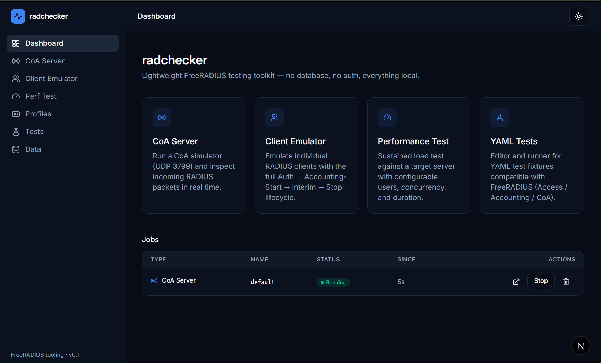

# radchecker



A web-based toolkit for testing and simulating FreeRADIUS deployments. Built with Next.js 15 (App Router), TypeScript, React 19, Tailwind CSS, and shadcn/ui — pure TypeScript RADIUS stack (no Python at runtime).

---

## Overview

`radchecker` is internal tooling for network engineers and operators who need to validate RADIUS servers, AAA flows, and CoA/Disconnect handling. It runs four independent features side-by-side, each as a managed in-memory job, with live log streaming over Server-Sent Events.

No login. No database. All configuration lives as YAML files under `data/`.

---

## Features

### 1. CoA Server Simulator
UDP listener on port **3799** that receives Change-of-Authorization and Disconnect-Request packets, answers with ACK/NAK according to a configurable policy, and streams every packet to a live log viewer.

### 2. Client Emulator
Emulates a RADIUS client session end-to-end: **Access-Request → Accounting-Start → Interim-Update → Accounting-Stop**. One profile = one client = one job. Multi-select profiles in the UI to spawn several independent client sessions in parallel.

### 3. Performance Test
Sustained RADIUS load test with a fixed worker pool (configurable concurrency × workers). Generates synthetic users with CHAP authentication, reports live RPS and latency percentiles.

### 4. YAML Test Runner
Edit and execute test fixtures (format compatible with the reference Python `tmp/tests/data/*.yaml` suite). Assertions, comparators, and result drill-down.

---

## Architecture

- **Runtime:** Next.js 15 App Router on Node.js, default port **4444**.
- **RADIUS stack:** [`radius`](https://www.npmjs.com/package/radius) npm package + `node:dgram` for UDP I/O.
- **Process model:** multi-job. An in-memory `Map<jobId, Job>` holds all active CoA servers, client sessions, perf tests, and YAML runs concurrently. Restart = everything gone (ephemeral by design).
- **Log transport:** Server-Sent Events (`GET /api/jobs/[id]/logs`), ring buffer of the last 500 lines per job.
- **Storage:** YAML-only, no database. Profile files are collections — all entries of a given type live in a single file:
  - `data/profiles/clients.yaml` — `{ clients: [...] }` — client emulator profiles
  - `data/profiles/servers.yaml` — `{ servers: [...] }` — RADIUS server targets
  - `data/profiles/coa_sender.yaml` — `{ coa_sender: [...] }` — CoA sender packet profiles
  - `data/profiles/coa_server.yaml` — `{ coa_server: [...] }` — CoA server simulator presets
  - `data/tests/<name>.yaml` — test fixtures (one file per fixture)
- **UI:** Tailwind + shadcn/ui + Radix primitives, `next-themes` for dark/light toggle, AppShell layout with sidebar navigation.

---

## Service ports

| Service | Port | Protocol |
|---|---|---|
| Next.js app | 4444 | HTTP |
| CoA server (runtime) | 3799 | UDP |
| RADIUS auth (target) | 1812 | UDP |
| RADIUS accounting (target) | 1813 | UDP |

---

## Getting started

```bash
pnpm install
pnpm dev          # http://localhost:4444
```

Other scripts:

```bash
pnpm build        # production build
pnpm start        # production server on :4444
pnpm lint         # ESLint (flat config)
pnpm typecheck    # tsc --noEmit
pnpm test         # Vitest
pnpm format       # Prettier
```

---

## Project layout

```
app/          Next.js App Router pages and API routes
components/   UI components (shadcn/ui + project-specific)
hooks/        React hooks
lib/          RADIUS stack, job registry, YAML I/O
  radius/    dictionary, CHAP encoder, perf test engine
data/         YAML configs (profiles, CoA, tests)
docs/         Project documentation
tmp/          READ-ONLY reference Python codebase
```

---

## Notes

- Intended for trusted local/LAN use — there is no authentication layer.
- The `tmp/` directory holds the original Python reference implementation and YAML seed fixtures. It is read-only and serves as the behavioural ground truth for the TypeScript rewrite.
- CHAP encoding follows RFC 1994/2865; `chap_id = 48` is skipped for parity with the pyrad-based reference (pyrad has a long-standing bug with that specific id).
